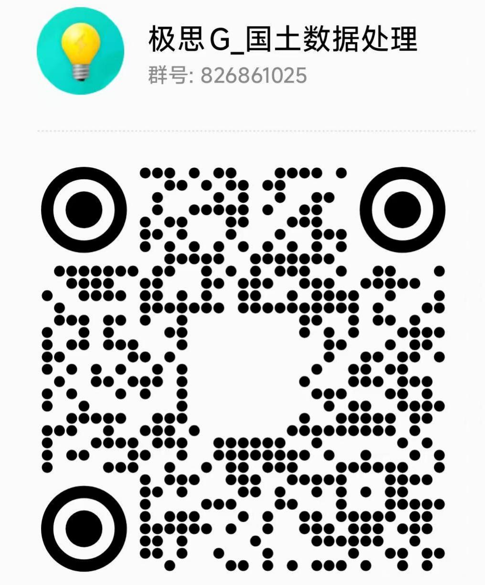

# 你好，我是陈得冠（edcfoshan）

> **GIS 工具开发者** · 专注测绘、国土与城乡规划行业的信息化工具开发
>
> 我的做事标准很简单：把行业里**最常做的小事**，做成**一键操作**。

## 🔧 我在做什么

- **桌面工具**：Tauri v2 + 纯 Rust 原生开发，绿色便携、离线可用；ArcGIS Pro Add-In（DAML / C#）
- **数据管道**：Python + ArcPy / GDAL，SHP · FileGDB · 界址点 TXT 的读写与互转
- **坐标投影**：CGCS2000 · 西安 80 · 北京 54 · WGS84，高斯-克吕格 3°/6° 分带
- **正在探索**：AI Agent × GIS —— 让大模型直接读懂并操作地理数据

## 🗺️ 开源代表作

| 项目 | 一句话介绍 |
|------|-----------|
| [**polygon-txt**](https://github.com/edcfoshan/polygon-txt)  | 极思G界址点互转工具 — SHP/GDB 面要素与界址点 TXT 双向转换，无损往返，纯 Rust 无需 ArcPy |
| [**ArcGISpro-baidu-amap-geocode-pyt**](https://github.com/edcfoshan/ArcGISpro-baidu-amap-geocode-pyt)  | 集成百度/高德 API 的 ArcGIS Pro 工具箱 — 地理编码、POI 搜索、行政区划边界、坐标系转换 |
| [**cadastral-to-vector**](https://github.com/edcfoshan/cadastral-to-vector) | 宗地图/地籍图 PNG → 矢量面要素（AI Agent + OCR 工作流，对话即处理） |
| [**arcgis-pro-addin-layout-agent**](https://github.com/edcfoshan/arcgis-pro-addin-layout-agent)  | 用结构化描述 + AI Agent 直接生成 ArcGIS Pro Add-In 的 DAML / C# 代码 |
| [**gispro-planner-assistant**](https://github.com/edcfoshan/gispro-planner-assistant) | 面向城乡规划师的 ArcGIS Pro 加载项工作台 — 前期调研 · 影像底图 · 地图跳转 |

## 📊 GitHub 统计

<picture>
  <source media="(prefers-color-scheme: dark)" srcset="https://raw.githubusercontent.com/edcfoshan/edcfoshan/main/profile-summary-card-output/github_dark/3-stats.svg" />
  <source media="(prefers-color-scheme: light)" srcset="https://raw.githubusercontent.com/edcfoshan/edcfoshan/main/profile-summary-card-output/github/3-stats.svg" />
  
</picture>
<picture>
  <source media="(prefers-color-scheme: dark)" srcset="https://raw.githubusercontent.com/edcfoshan/edcfoshan/main/profile-summary-card-output/github_dark/1-repos-per-language.svg" />
  <source media="(prefers-color-scheme: light)" srcset="https://raw.githubusercontent.com/edcfoshan/edcfoshan/main/profile-summary-card-output/github/1-repos-per-language.svg" />
  
</picture>
<picture>
  <source media="(prefers-color-scheme: dark)" srcset="https://raw.githubusercontent.com/edcfoshan/edcfoshan/main/profile-summary-card-output/github_dark/2-most-commit-language.svg" />
  <source media="(prefers-color-scheme: light)" srcset="https://raw.githubusercontent.com/edcfoshan/edcfoshan/main/profile-summary-card-output/github/2-most-commit-language.svg" />
  
</picture>

## 🐍

<picture>
  <source media="(prefers-color-scheme: dark)" srcset="https://raw.githubusercontent.com/edcfoshan/edcfoshan/output/github-snake-dark.svg" />
  <source media="(prefers-color-scheme: light)" srcset="https://raw.githubusercontent.com/edcfoshan/edcfoshan/output/github-snake.svg" />
  
</picture>

## 📮 联系我

扫码关注公众号、加入交流群：

| 微信公众号 | QQ 交流群 |
|:---:|:---:|
|  |  |
